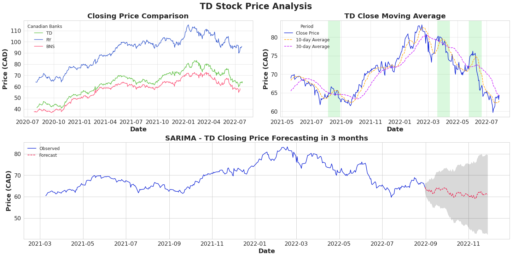

# Canadian-Banks-Stock-Market-Analysis

<br/>
<p align="center">
  <h3 align="center">Analyzing average stock prices of TD, RBC and Scotia Bank.</h3>

  <p align="center">
   Predictive analysis for time series forcasting using SARIMA and XGBoost machine learning models.
    <br/>
    <br/>
    <a href="https://github.com/yashcoder007/Canadian-Banks-Stock-Market-Analysis"><strong>Explore the docs »</strong></a>
    <br/>
    <br/>
    <a href="https://github.com/yashcoder007/Canadian-Banks-Stock-Market-Analysis

">View Demo</a>
    .
    <a href="https://github.com/yashcoder007/Canadian-Banks-Stock-Market-Analysis/issues"> Report Bug</a>
    .
  </p>
</p>

      

## Table Of Contents

* [About the Project](#about-the-project)
* [Built With](#built-with)
* [Getting Started](#getting-started)
  * [Prerequisites](#prerequisites)
  * [Installation](#installation)
* [Usage](#usage)
* [Contributing](#contributing)
* [License](#license)
* [Authors](#authors)
* [Acknowledgements](#acknowledgements)

## About The Project




The project's motivation was to future forecast the average stock prices of TD, Scotia and RBC bank. Time series analysis is done using the state of the art SARIMA and XGBoost. Three months of future forecasting is done using regression models. 

Firstly, I did extensive data cleaning and visualizations using libraries like Pandas, Matplotlib, Seaborn and NumPy. I created a lot of count plots, point plots, and other graphs.

Secondly, I did some Feature Engineering and Manual Hyperparameter tuning. These features helped in increasing the accuracy of the model.

Thirdly, the SARIMA and XGBoost Regressor were trained on the time series data and prediction. The models performed at a mean squared error of less than 1.5 %.

Lastly, Data Visualizations was done.


## Built With

Python

* [jupyter ](https://jupyter.org/)
* [scikit-learn](https://scikit-learn.org/stable/)
* [Numpy](https://numpy.org/)
* [pandas](https://pandas.pydata.org/)
* [SciPy](https://scipy.org/)
* [Matplotlib](https://matplotlib.org/)
* [XGBoostRegressor](https://xgboost.readthedocs.io/en/stable/parameter.html)
* SARIMA


## Getting Started

Create a new virtual environment and install all the required packages.

### Prerequisites

The python libraries mentioned in Built With

### Installation

1. Download the dataset
```sh
https://www.macrotrends.net/stocks/charts/RY/royal-bank-of-canada/stock-price-history```

2. Clone the repo

```sh
https://github.com/yashcoder007/Canadian-Banks-Stock-Market-Analysis.git
```
3. Install packages using  conda or pip.
For example:  "pip install -U scikit-learn" or "conda install -c conda-forge scikit-learn"

            jupyter
            scikit-learn
            Numpy
            pandas
            SciPy
            Matplotlib
            SARIMA
            XGBoostRegressor

## Usage

1. Download the dataset from the link given.
2. Clone the repo
3. Download and use the .ipynb with jupyter notebooks.


## Contributing

Contributions are what make the open source community such an amazing place to be learn, inspire, and create. Any contributions you make are **greatly appreciated**.
* If you have suggestions for adding or removing projects, feel free to [open an issue](https://github.com/yashcoder007/Canadian-Banks-Stock-Market-Analysis
/issues) to discuss it, or directly create a pull request after you edit the *README.md* file with necessary changes.
* Please make sure you check your spelling and grammar.
* Create individual PR for each suggestion.
* Please also read through the [Code Of Conduct](https://github.com/yashcoder007/Canadian-Banks-Stock-Market-Analysis.git/blob/main/CODE_OF_CONDUCT.md) before posting your first idea as well.

### Creating A Pull Request

1. Fork the Project
2. Create your Feature Branch (`git checkout -b feature/AmazingFeature`)
3. Commit your Changes (`git commit -m 'Add some AmazingFeature'`)
4. Push to the Branch (`git push origin feature/AmazingFeature`)
5. Open a Pull Request

## License

Distributed under the MIT License. See [LICENSE](https://github.com/yashcoder007/Canadian-Banks-Stock-Market-Analysis.git/blob/main/LICENSE.md) for more information.

## Authors

* **Yash Trivedi** - *Data Scientist/ Machine Learning Researcher* - [Yash Trivedi](https://github.com/yashcoder007)
